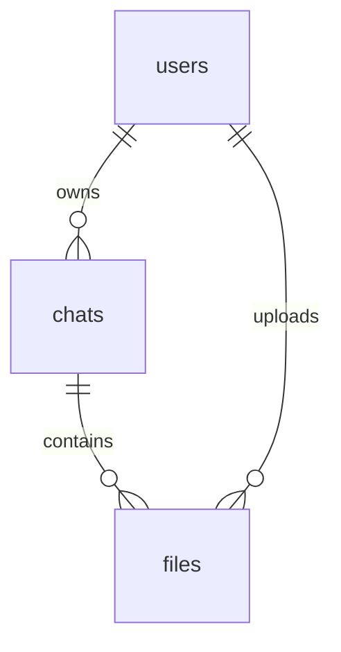

# LegalEase Database Schema Review

This document provides a comprehensive review of the **LegalEase** database schema. LegalEase uses **MongoDB** as its primary document database, chosen for its flexibility in nesting conversational records and speed in querying unstructured/semi-structured data.

---

## 1. Database Architecture & Collections

The database consists of three core collections:
1. **`users`**: Manages user accounts, credentials, and profile creation.
2. **`chats`**: Houses multi-turn conversations, including embedded messages, system prompts, and sharing metadata.
3. **`files`**: Tracks metadata for documents uploaded by users (e.g., PDFs, contracts, images). The actual raw files are stored securely on the local filesystem (under `C:\legalEaseDB` or local server `uploads`).



---

## 2. Collection Schemas in Detail

### A. The `users` Collection
Stores user profile information and security credentials for account authentication.

#### Schema Structure (JSON Representation)
```json
{
  "_id": ObjectId("69da98d356c7c39e39d2dc16"),
  "user_id": "user_3089ba2af7b8",
  "username": "musab",
  "email": "musabmushtaq952@gmail.com",
  "password": "$2b$12$ncNxlwj5nc/SPP2Eft5UDOgXLqoHzGp9F2Jv/6hbIAbXerZyGB42S",
  "context": "I am a real estate attorney looking for landlord-tenant templates.",
  "created_at": "2026-04-11T18:54:11.380895+00:00"
}
```

#### Field Explanations
| Field Name | Data Type | Purpose / Description |
| :--- | :--- | :--- |
| `_id` | `ObjectId` | MongoDB's auto-generated unique document key. |
| `user_id` | `String` | Application-level unique identifier (e.g., `user_{12-character hex string}`). Acts as the primary relation key for references in other collections. |
| `username` | `String` | The unique screen name/login handle selected by the user. |
| `email` | `String` | The user's primary email address, utilized for communications, password resets, and login identification. |
| `password` | `String` | A cryptographically secure, one-way hash (Bcrypt, 12 rounds) of the user's password. Never stored in plaintext. |
| `context` | `String` | User-provided background details and context used to dynamically tailor legal responses. |
| `created_at`| `String (ISO)`| Precise timestamp of account registration. |

#### Database Indexes
* `{ "user_id": 1 }` (**Unique**): Guarantees that application-level user IDs never collide, enabling swift lookup during authentication.
* `{ "email": 1 }` (**Unique**, **Sparse**): Prevents duplicate emails from registering and speeds up email-based lookups.

---

### B. The `chats` Collection
The heart of LegalEase. It represents a single legal consultation session. Messages are embedded directly within the chat document as an array for atomic retrieval and optimized performance.

#### Schema Structure (JSON Representation)
```json
{
  "_id": ObjectId("6a0c35f352680fd21fbcb9f2"),
  "chat_id": "chat_f82cc27847b4",
  "owner_id": "user_af748175fe85",
  "collaborators": ["user_b28192cd44f1"],
  "title": "Hello.",
  "is_pinned": false,
  "messages": [
    {
      "id": "msg_8d249f05a1ce",
      "chat_id": "chat_f82cc27847b4",
      "sender": "user",
      "content": "Hello.",
      "created_at": "2026-05-19T10:05:39.980116+00:00",
      "user_id": "user_af748175fe85",
      "file_id": null,
      "filename": null
    },
    {
      "id": "msg_90e38bc2fa01",
      "sender": "ai",
      "content": "Hello! I am LegalEase, your AI-powered legal assistant. How can I help you today?",
      "created_at": "2026-05-19T10:05:44.284062+00:00"
    }
  ],
  "created_at": "2026-05-19T10:05:39.980116+00:00",
  "updated_at": "2026-05-19T10:05:44.284062+00:00"
}
```

#### Field Explanations
| Field Name | Data Type | Purpose / Description |
| :--- | :--- | :--- |
| `_id` | `ObjectId` | Auto-generated unique document key. |
| `chat_id` | `String` | Unique application-level ID for the chat session (prefixed with `chat_`). |
| `owner_id` | `String` | References the `user_id` of the user who owns this chat. |
| `collaborators` | `Array` | References `user_id`s of invited users who have access to this chat. |
| `title` | `String` | The visible name of the chat in the sidebar (summarized automatically via Gemini). |
| `is_pinned` | `Boolean` | Flag indicating if this chat is pinned to the top of the list for quick access. |
| `messages` | `Array` | A sub-document array representing the history of user and AI turns (see below). |
| `created_at` | `String (ISO)`| Chat initiation timestamp. |
| `updated_at` | `String (ISO)`| Updated whenever a message is added, deleted, or edited. Controls chronology sorting. |

#### Embedded Message Sub-Document Fields
* **`id`**: Unique message key (e.g., `msg_8d249f05a1ce`).
* **`sender`**: Categorized as `"user"` or `"ai"`.
* **`content`**: The plain text markdown message body.
* **`created_at`**: Creation timestamp of this specific message.
* **`user_id`**: Associated user ID.
* **`file_id`** *(Optional)*: References `file_id` in the `files` collection if a document is attached.
* **`filename`** *(Optional)*: Plain text filename for immediate display without hitting the files collection.
* **`edited_at`** *(Optional)*: Tracks when a user edits their message.

#### Database Indexes
* `{ "chat_id": 1 }` (**Unique**): Rapid single chat retrieval.
* `[("owner_id", 1), ("updated_at", -1)]` (**Compound**): Powers the sidebar loading. Retrieves all chats belonging to a user, instantly sorted from most recent to oldest.


---

### C. The `files` Collection
Acts as the central registry for user-uploaded files, tracking file locations for contextual AI RAG pipelines.

#### Schema Structure (JSON Representation)
```json
{
  "_id": ObjectId("6e0c12e847c21faef5d19a2e"),
  "file_id": "file_a7e937d10b9d",
  "filename": "lease_agreement.pdf",
  "file_path": "C:\\repo\\LegalEase\\api\\uploads\\file_a7e937d10b9d_lease_agreement.pdf",
  "chat_id": "chat_f82cc27847b4",
  "uploaded_at": "2026-05-19T10:05:39.980116+00:00"
}
```

#### Field Explanations
| Field Name | Data Type | Purpose / Description |
| :--- | :--- | :--- |
| `_id` | `ObjectId` | Auto-generated unique document key. |
| `file_id` | `String` | Unique application-level file key (prefixed with `file_`). |
| `filename` | `String` | Original name of the uploaded document (e.g. `"lease_agreement.pdf"`). |
| `file_path` | `String` | The exact path where the backend server saved the file to disk (RAG and parsing endpoint reads from here). |
| `chat_id` | `String` | The ID of the chat thread where this file was uploaded. |
| `uploaded_at`| `String (ISO)`| Timestamp indicating upload completion. |

#### Database Indexes
* `{ "file_id": 1 }` (**Unique**): Fast single metadata access.
* `[("user_id", 1), ("uploaded_at", -1)]` (**Compound**): Tracks user's uploaded history sorted by upload recency.

---

## 3. Relationships & Data Flow

```
[users] 1  <───>  Many [chats]
                       └───> [messages] Array (Embedded)
                                 └───> Optional [file_id] Ref <───> 1 [files]
```

### Essential Design Decisions:
1. **Embedded Messages for Atomicity**: Rather than a separate `messages` collection requiring a slow join, all messages are embedded within their parent `chat`. Since a chat rarely exceeds a few hundred messages, this keeps document sizes way below MongoDB's 16MB limit while ensuring that querying a chat fetches its entire history in one network roundtrip.
2. **Hybrid File Storage**: Actual binary blobs are kept in the filesystem (highly efficient for reading, streaming, and caching), while lightweight metadata is indexed in MongoDB (making search, deletion, and context mapping extremely fast).
3. **UTC Time Stamps**: All timestamps use standard ISO UTC formats, preventing client-server time zone synchronization mismatch bugs.
