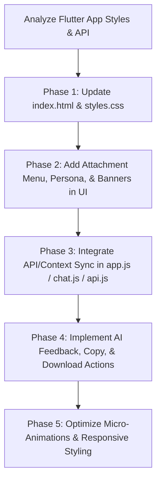

# LegalEase Web UI Redesign Implementation Plan

This implementation plan details the strategy to redesign and enhance the `web` workspace to mirror the premium visual aesthetics, user flow, and feature set of the LegalEase Flutter mobile application. The target is a highly responsive, modern, desktop-friendly web application with smooth micro-animations, glassmorphic themes, and cohesive feature parity (excluding live calls).

---

## 1. Core Visual Architecture & Design Language

We will transition the web UI to match the highly curated, dark, luxury glassmorphic style of the Flutter app.

### Brand Style Guide
- **Scaffold/Primary Background**: `#131313` (rich deep-charcoal black)
- **Brand Accent/Highlight**: `#FCE566` (warm premium gold/yellow-gold)
- **Primary Body Text**: `#F7F1FF` (clean soft white-lavender)
- **Secondary/Supporting Text**: `#999999` (neutral slate grey)
- **Font Face**: `'Lexend'`, Google Fonts (modern, highly readable, structured rounded geometric font)

### Advanced Glassmorphism & UI Tokens
- **User Message Cards**:
  - Background: `rgba(255, 255, 255, 0.08)`
  - Border: `1px solid rgba(255, 255, 255, 0.1)`
  - Radius: `18px` all around
  - Backdrop Filter Blur: `30px` (provides a stunning frosted crystal look)
- **AI Messages**:
  - Rendered directly on the dark scaffold background (no bounding cards) to maximize readability, with an elegant action bar underneath.
- **Temporary Chat Mode Styling**:
  - Elements (borders, toggle button, prompt input, icons) dynamically transition to **dotted dashes** (`border-style: dotted`, `dashPattern: [6, 4]`), giving a clear, playful indicator of non-permanence.

---

## 2. Page & Component Structure

### A. Auth / Welcome View Redesign
- **Glowing Balance Emblem**: A premium center emblem consisting of:
  - An outer glowing ring (`width: 96px`, `height: 96px`, shape: circle) with a background of `rgba(252, 229, 102, 0.03)`, a border of `rgba(252, 229, 102, 0.12)`, and a blur-shadow of `#FCE566` with opacity `0.06` (`box-shadow: 0 0 32px 8px rgba(252, 229, 102, 0.06)`).
  - An inner concentric ring (`width: 76px`, `height: 76px`, shape: circle) with a border of `rgba(252, 229, 102, 0.08)`.
  - A centered gold justice scales icon (`Icons.balance_rounded`) with scale animations on hover.
- **Auth Inputs**:
  - Translucent fields (`rgba(255, 255, 255, 0.05)` fill) with soft rounded edges (`border-radius: 16px`), transitioning to a solid `#FCE566` border on focus.
- **Auth Buttons**:
  - Large premium solid `#FCE566` buttons with deep grey text (`#131313`) and rounded corners (`border-radius: 16px`).

### B. Chat Interface & Main Console
- **Top Bar**:
  - Left: Collapsible Hamburger menu & New Chat buttons (dotted if temporary mode is active).
  - Right: User status displays ("Guest", "Temporary", or Username).
- **Message List**:
  - Custom transition animations when new bubbles enter.
  - Gradient scroll masking (soft linear fade-out at the top and bottom edges of the messages viewport).
- **Interactive Action Bar (for AI replies)**:
  - Custom horizontal actions beneath AI messages:
    - **Thumbs Up / Thumbs Down** feedback buttons that toggle highlight styles (warm gold for positive, translucent red-accent for negative).
    - **Copy to Clipboard** button showing a localized success indicator.
- **Attachment Cards inside User Messages**:
  - Full-width inner card placed flush inside the user message bubble:
    - Translucent `#000000` with `0.18` opacity, nested rounded borders.
    - Visual indicators (e.g. specialized icons for images vs. documents).
    - Single-line title truncation and click-to-download action.

### C. Floating Action Controls (The Prompt Console)
- **Integrated Animated Attachment Menu**:
  - Clicking the attachment paperclip triggers a premium micro-animated vertical popup menu (`opacity` fade & `transform` translate slide-up).
  - Contains icons for:
    1. **Camera / Quick Image Upload**
    2. **Image Gallery Upload**
    3. **File Document Upload**
    4. **Persona / Context Mode Toggle**: A toggle button represented by a person profile icon. When clicked, it activates context mode, which is dynamically communicated to the backend API (`use_context: true`).
- **Context/Persona Active Pill**:
  - An elegant floating banner that slides down/up above the input box showing "Context/Persona mode active" with a yellow accent person icon.
- **Connectivity & Download Banners**:
  - Floating banners styled as high-blur glassmorphic pills that float above the prompt console.
  - *Connectivity Banner*: Shows an offline message with an immediate retry button when `ping` connectivity fails.
  - *Download Status Banner*: Active during file downloads, showing "Downloading {filename}..." with an integrated circular spinning loader.

---

## 3. Web UI Implementation Roadmap

Our edits will be restricted entirely to the `/web` directory as per constraints:

### Phase 1: Foundation & CSS Tokens (`styles.css`)
- Inject updated CSS variables for advanced glassmorphism (`--bg-glass-card`, `--border-glass`, `--shadow-glow`, etc.).
- Update body, container, message, and form styles to support Lexend and dynamic transitions.
- Build class systems for dotted borders (`.temp-dotted-border`) to support temporary chat styling.

### Phase 2: DOM & Layout Overhaul (`index.html`)
- Integrate new layout sections for the floating attachment menu.
- Incorporate the Glowing Balance Emblem within the login/registration modals.
- Create container templates for the float-banners (Context Pill, Download Banner, and Connection Status).

### Phase 3: Controller & Service Updates (`web/js/`)
- **`js/ui.js`**:
  - Redesign message template rendering: user message glass bubbles, attachments cards, AI direct markdown texts, and AI action bars.
  - Add attachment menu show/hide animations and toggle handling.
  - Integrate banner display states.
- **`js/chat.js` & `js/api.js`**:
  - Capture Context mode state (`state.useContext = true/false`).
  - Update `sendMessage` API parameters to pass `use_context` flag.
  - Implement download actions by retrieving file buffers from the `/api/files/{id}` endpoint.
- **`index.js`**:
  - Connect new UI buttons (Persona click, Thumbs click, Copy click).

---

## 4. Architectural Safeguards

- **Performance**: High blur filters (`backdrop-filter: blur(30px)`) are accelerated via hardware translates (`transform: translate3d(0,0,0)`) to maintain 60 FPS on desktop browsers.
- **Offline Fault Tolerance**: The polling recovery loop mimics Flutter's 2-second polling to ensure instant connection state restoration when the backend comes online.
- **Accessbility**: Keyboard-driven navigation remains fully supported on input panels, and semantic ARIA structures are preserved.
